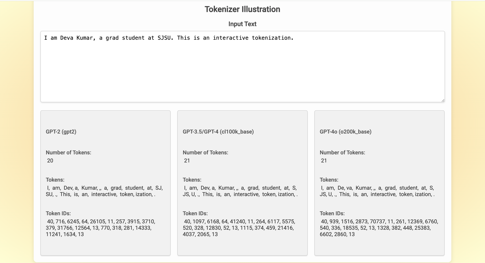

# Illustrating GPT Tokenizers

Large Language Models introduced by OpenAI (called GPT models) use a process called Tokenization to convert words to numbers since neural networks only understand numbers. This repo is a fun project which shows how the text is actually converted to tokens and the number of tokens for various Encodings. 

- `gpt2` - This is used in GPT-2 model.
- `gpt-3.5` - This is used in GPT-3 and GPT-4 models.
- `gpt-4o` - This is the one used in latest GPT-4o model

The dashboard provides an interactive way to show how words are tokenized with each tokenizer in real-time as a side-by-side comparison. 

Live -> On [render](https://illustrative-tokenizers.onrender.com/)

## Steps to run this localy (via command line)
1. Clone this repository
```
git clone https://github.com/gdevakumar/Illustrative-Tokenizers.git
cd Illustrative-Tokenizers
```

2. Install Python from [here](https://www.python.org/downloads/) and project dependencies
```
pip install -r requirements.txt
```

3. Launch the Web UI with Flask application
```
python3 app.py
```

## Steps to run this localy (via Docker)
Use this method if you have Docker/Docker Desktop installed.

1. Clone this repository
```
git clone https://github.com/gdevakumar/Illustrative-Tokenizers.git 
cd Illustrative-Tokenizers
```

2. Build the docker image (*Notice the dot(.) at the end of command*). This may take sometime initially
```
docker build -t tokenizers .
```

3. Run the Docker image
```
docker run -p 5000:5000 tokenizers
```

## Demo

### Screenshot



--- 

### Video
<div>
    <a href="https://www.loom.com/share/830bf02d6d77420c8aa0de431b092261">
      <p>Demo Video</p>
    </a>
    <a href="https://www.loom.com/share/830bf02d6d77420c8aa0de431b092261">
      
    </a>
  </div>
